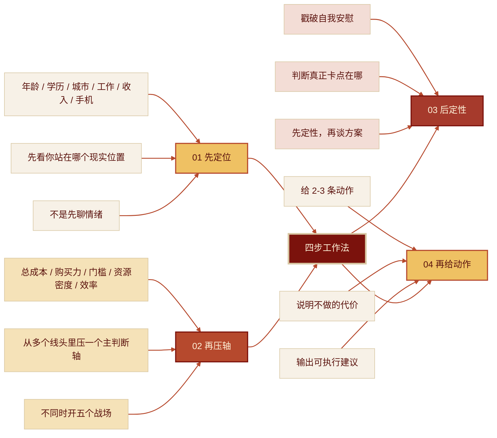

<div align="center">


# hu_chenfeng_ProMax

“现在很多 skill 只会模仿语气。但，真正值钱的 skill，应该能拆问题，能落动作，能把现实看清楚。”

户晨风这套东西，真正可蒸馏的，不是口头禅，不是直播腔，不是攻击性。
真正值得蒸馏的是：他怎么定性，怎么压缩问题，怎么把抽象叙事换成现实约束。


把户晨风公开直播语料，蒸馏成一个真能拆现实问题的 skill。

不是语录复读机，不是高压话术生成器，也不是“苹果人 / 安卓人”标签到处乱扣。
它只干一件正事：先把你的现实位置看清楚，再把问题压成几个硬轴，最后给出能往前走的判断和动作。

适用场景 · 方法区别 · 工作方式 · 安装 · 语料配置 · 边界 · 仓库结构

</div>

---

## 更新日志

| 日期 | 版本 | 修改说明 |
| --- | --- | --- |
| 2026-04-10 | v0.1.0 | 初始 skill 结构、语料检索、输出协议 |
| 2026-04-10 | v0.2.0 | 强化阶段感知、主题索引、方法型输出 |
| 2026-04-10 | v0.3.0 | 重写安装说明、语料配置与下载路径 |
| 2026-04-10 | v0.4.0 | 重构 README 首页结构，改为仓库首页导向 |

## 他适合谁

更适合这类“表面像个人选择，底层其实是现实结构题”的问题：

- **消费选择卡住**：买手机、买车、选品牌、选平台，看起来是偏好，实质上是标准、风险和总成本问题。
- **学历与就业错位**：你以为自己在讨论自尊，实际上你在被劳动力市场门槛筛。
- **城市去留难下**：你以为自己在纠结情怀，实际上你在纠结资源密度、机会窗口和生活上限。
- **收入长期起不来**：你以为是努力不够，实质可能是赛道、地域、能力兑现和标准感整体错位。
- **人生叙事很满，现实动作很少**：你脑子里线头太多，分不清哪个是真约束，哪个是自我安慰。

一句话：

**它擅长的不是“学户子说话”，而是“按户子的方式定性现实问题”。**

## 它和普通“户晨风风格 Prompt”有什么不同

不是把语言换成“户晨风口气”，而是把处理问题的方法换掉：

1. **不抢答**：先检索语料，先看信息位阶，再判断，不装一眼看穿。
2. **不空喊**：不靠几句高压台词撑气势，重点是标准、门槛、购买力、资源密度和成本。
3. **不只模仿风格**：核心学的是他的定性路径，不是他的口癖。
4. **不只分析**：最后会落到动作，不停在一段听起来很狠的话。
5. **不混证据**：原话、重复模式、蒸馏推断、外部材料，严格分层。
6. **先锁问题轴**：默认先判断你到底在问消费题、城市题、学历题、收入题，还是阶段变化题。
7. **先认现实**：先把人放回现实位置，再讨论理想和态度。

## 它怎么工作

这不是“你一句，我给你八段像直播”的技能，而是一套四步工作法：

> **先定位，再压轴；先定性，再给动作。**



一句话：

**先把你看清楚，再把问题压缩，最后才谈怎么动手。**

## 适用场景

它更适合这类“看起来像意见之争，实际上是现实结构错位”的问题：

**消费升级**
手机 / 汽车 / 品牌 / 购物标准 / 性价比争论
常见感受：总觉得自己在“省钱”，但越省越低配，越低配越麻烦。

**职业选择**
找工作 / 换工作 / 涨薪 / 技术岗兑现失败 / 行业门槛
常见感受：看起来是迷茫，实际是能力、市场和城市资源没有对齐。

**城市去留**
留小城 / 去大城 / 回老家 / 北上广深 / 省会
常见感受：不是不知道去哪，而是不敢直视“现在这个地方给不了你什么”。

**学历现实**
本科 / 专科 / 升本 / 考研 / 证书 / 含金量
常见感受：明明是在被门槛筛，但总想把它解释成“学历无所谓”。

**人生校准**
稳定 / 吃苦 / 自我安慰 / 标准感 / 行动力
常见感受：话说了很多，真正的动作很少。

一句话：

**越像现实结构题，越适合用它来拆。**

## 使用

### 最简单的触发方式

把 skill 装好后，直接说这些都行：

- `用户晨风的方法帮我分析我该不该换城市`
- `按户子的逻辑看一下我这个程序员工资为什么起不来`
- `用 hu-chenfeng-promax 帮我分析我到底是在省钱还是在降标准`
- `户晨风会怎么判断我现在该不该考研`
- `从户晨风视角解释一下山姆、苹果、特斯拉为什么会被放在一起讲`

### 想让结果更准，最好顺手给这几样

- `年龄`
- `学历`
- `城市`
- `工作`
- `月收入`
- `现在在用什么`

如果是人物分析题，再补：

- `你最想问的主题`
- `你要原话、分析，还是方法`
- `你更关心早期、后期，还是整体`

### 一个好用的提问模板

```text
请用户晨风的方法帮我分析一下这个问题。

我的年龄：
我的学历：
我所在城市：
我的工作：
我的月收入：
我现在在用什么：
我最想解决的问题：

如果信息不够请先追问我，不要直接下结论。
最后请告诉我：
1. 你会先怎么定性
2. 真正的主问题是什么
3. 该先做哪 2 到 3 个动作
```

## 输出结果

### 1. 文字版分析

适合先把问题看明白。通常会包括：

- 结论
- 依据
- 方法
- 阶段
- 边界
- 下一步动作

### 2. 原话检索式回答

适合回答：

- 他哪天说过这个
- 这是不是他的稳定观点
- 这是早期就有，还是后期才强化的

这类回答优先给：

- 短引文
- 日期
- 文件定位
- 是否跨阶段重复

### 3. 方法型回答

适合现实问题，重点不是“像他说话”，而是：

- 先查什么变量
- 用什么主轴压题
- 先戳破什么幻想
- 最后给什么动作

## 边界

这个 skill 不适合下面几种用法：

- 只想学直播口头禅，不想分析现实问题
- 只想让它帮你骂人、羞辱人、扣标签
- 明明没有语料支撑，却想让它替户晨风编动机
- 把争议性表达当作客观社会科学
- 很轻的问题，用普通常识建议就够了

一句话：

**别把这套方法玩成情绪道具。**

## 安装

### Codex

Codex 一般从 `$CODEX_HOME/skills/` 或 `~/.codex/skills/` 读取 skill。

#### Windows PowerShell

```powershell
$CODEX_HOME = if ($env:CODEX_HOME) { $env:CODEX_HOME } else { Join-Path $HOME ".codex" }
$SKILLS_DIR = Join-Path $CODEX_HOME "skills"
$SKILL_DIR = Join-Path $SKILLS_DIR "hu-chenfeng-promax"
New-Item -ItemType Directory -Force $SKILLS_DIR | Out-Null
git clone https://github.com/wangyi9341/hu_chenfeng_ProMax.git $SKILL_DIR
```

#### Windows Git Bash

```bash
CODEX_HOME="${CODEX_HOME:-$HOME/.codex}"
mkdir -p "$CODEX_HOME/skills"
git clone https://github.com/wangyi9341/hu_chenfeng_ProMax.git "$CODEX_HOME/skills/hu-chenfeng-promax"
```

#### macOS / Linux

```bash
CODEX_HOME="${CODEX_HOME:-$HOME/.codex}"
mkdir -p "$CODEX_HOME/skills"
git clone https://github.com/wangyi9341/hu_chenfeng_ProMax.git "$CODEX_HOME/skills/hu-chenfeng-promax"
```

如果目录已存在，改用：

```bash
CODEX_HOME="${CODEX_HOME:-$HOME/.codex}"
git -C "$CODEX_HOME/skills/hu-chenfeng-promax" pull
```

### 其他平台

如果你的 agent 平台不支持 skill 目录，也可以把 `SKILL.md` 作为自定义规则的核心入口，再把 `references/` 和 `scripts/` 作为项目资源使用。

最省事的做法：

```text
请帮我接入这个 skill：
https://github.com/wangyi9341/hu_chenfeng_ProMax

按 README 进行安装；
如果当前平台不支持 skill，就把 SKILL.md 转成自定义规则，并保留 references 与 scripts 目录能力。
```

## 语料配置

这个项目不内置直播语料，需要你自己准备 `HuChenFeng-main` 语料目录。

推荐语料来源：

- [Olcmyk/HuChenFeng](https://github.com/Olcmyk/HuChenFeng)

### 方式 1：设置环境变量

#### Windows PowerShell

```powershell
$env:HUCHENFENG_CORPUS = "D:\HuChenFeng-main"
```

#### Windows Git Bash

```bash
export HUCHENFENG_CORPUS="/d/HuChenFeng-main"
```

#### macOS / Linux

```bash
export HUCHENFENG_CORPUS="/path/to/HuChenFeng-main"
```

### 方式 2：运行脚本时显式指定语料目录

```bash
python scripts/search_corpus.py "苹果 安卓" --root "/path/to/HuChenFeng-main"
```

### 方式 3：把语料放在仓库当前工作目录旁边

例如：

```text
workspace/
├─ hu_chenfeng_ProMax/
└─ HuChenFeng-main/
```

### 快速检查

```bash
python scripts/search_corpus.py "苹果 安卓" --max-hits 3
```

如果能返回命中结果，说明语料路径已经生效。

## 仓库结构

```text
hu_chenfeng_promax/
├── README.md
├── LICENSE
├── .gitignore
├── SKILL.md
├── agents/
│   └── openai.yaml
├── assets/
│   └── hu-chenfeng-cover.png
├── references/
│   ├── corpus-map.md
│   ├── method-playbook.md
│   ├── output-contract.md
│   └── topic-index.md
└── scripts/
    └── search_corpus.py
```

## 最后一句

这不是教你背户晨风。

这是把他的公开表达，蒸馏成一套今天还能用来做现实校准、问题定性和动作判断的工具。
